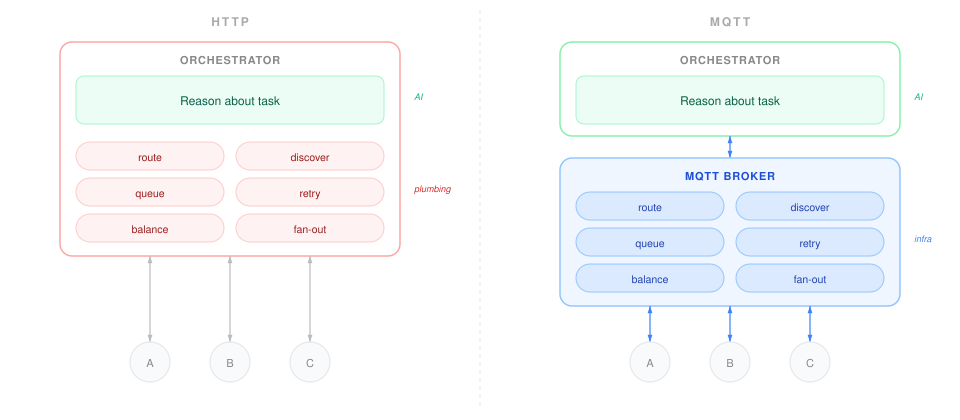

# Skitter

> **Warning: Experimental Proof-of-Concept**
> Skitter currently has no authentication, no TLS, and agents run with bypass permissions. Please only run this on localhost or inside a trusted, firewalled environment.

Skitter is a personal AI assistant built on MQTT.

Instead of a monolithic agent process that tries to handle orchestration, LLM calls, and chat I/O all in one place, Skitter completely decouples the stack. A stateless coordinator manages a task DAG via an MQTT broker, while independent workers handle the actual AI reasoning.

The whole system is ~2,500 lines of Python.

## Prerequisites

* Docker (for the MQTT broker)
* Python 3.10+
* [uv](https://docs.astral.sh/uv/)
* Claude Code logged in (any plan supporting Claude Code)

## Quickstart

1. **Start the MQTT broker**
   ```bash
   docker compose up -d
   ```

2. **Install dependencies and start the coordinator**
   ```bash
   uv sync
   uv run python -m skitter
   ```

3. **Initialize predefined agents and pipelines**
   ```bash
   uv run python -m skitter init
   ```
   Creates `~/.skitter/agents/` and `~/.skitter/pipelines/` with starter YAML files. Safe to re-run.

4. **Run an agent directly** (in another terminal)
   ```bash
   uv run python -m skitter agents run researcher "What are the key features of MQTT v5?"
   ```

   Or **run a pipeline** for multi-step DAG execution:
   ```bash
   uv run python -m skitter pipeline run deep-research --var topic="MQTT v5"
   ```

   Or use the **interactive chat client** for both:
   ```bash
   uv run python -m skitter chat
   ```
   Type `/agent researcher What is MQTT v5?` or `/pipeline deep-research --var topic=MQTT`, then `/send`. Use `/drop` to discard. Use `--chat-id` to set a specific session ID:
   ```bash
   uv run python -m skitter chat --chat-id my-session
   ```

5. **Watch it work** — open `dashboard.html` in a browser to see jobs, tasks, and DAG execution in real time. Connects to the broker's WebSocket endpoint (`ws://localhost:8083/mqtt`) using MQTT v5, no backend required.

*You can also use any MQTT v5 client directly (`mqttx`, `mosquitto_pub`/`mosquitto_sub`, custom Telegram/Slack bots, etc). Publish A2A requests to the coordinator's request topic with Response Topic and Correlation Data properties.*

## Predefined Agents

Define reusable, tunable agent profiles in `~/.skitter/agents/`:

```yaml
# ~/.skitter/agents/researcher.yaml
name: Research Specialist
description: Deep research with source citation
soul: |
  You are a research specialist. Be thorough, cite sources,
  and distinguish fact from speculation.
skills: |
  Search broadly before going deep. Cite URLs for every claim.
model: sonnet
max_turns: 15
```

Pipeline tasks reference agents by ID (e.g., `agent: researcher`). The agent's defaults (model, max_turns, etc.) are applied automatically. Pipeline tasks can still override any field. On startup, the coordinator publishes Agent Cards as retained MQTT messages for A2A discovery.

Manage and run agents with the CLI:

```bash
uv run python -m skitter agents list           # table of loaded agents
uv run python -m skitter agents show researcher # full YAML dump
uv run python -m skitter agents run researcher "What is MQTT v5?"  # run directly
```

## Pipelines

Pipelines are named DAG templates in `~/.skitter/pipelines/`:

```yaml
# ~/.skitter/pipelines/deep-research.yaml
name: Deep Research
description: Multi-source research with fact-checking
variables:
  - topic
tasks:
  - logical_id: research_web
    agent: researcher
    description: "Research '{topic}' using web sources."
    depends_on: []
  - logical_id: research_academic
    agent: researcher
    description: "Research '{topic}' focusing on academic papers."
    depends_on: []
  - logical_id: fact_check
    agent: reviewer
    description: "Cross-reference findings about '{topic}'. Flag contradictions."
    depends_on: [research_web, research_academic]
  - logical_id: synthesize
    agent: writer
    description: "Combine all research findings about '{topic}' into a clear, coherent response."
    depends_on: [fact_check]
```

Run pipelines from the CLI:

```bash
uv run python -m skitter pipeline list
uv run python -m skitter pipeline run deep-research --var topic="quantum computing"
```

Variable interpolation uses a safe formatter that leaves unknown `{...}` patterns untouched (won't break JSON in descriptions). Pipeline tasks reference agent IDs and inherit their defaults.

## Why MQTT?

In a typical HTTP-based AI system, the orchestrator handles routing, retries, fan-out, and load balancing on top of the actual AI reasoning. By leaning on MQTT, we push all that infrastructure into the broker.

[](http-vs-mqtt.svg)

What this means in practice:

* **Zero-code UI integrations:** To connect Telegram or WhatsApp, you just write a tiny ~100-line bridge script that publishes A2A requests to the coordinator's request topic and subscribes to a reply topic. The core AI coordinator never changes.
* **Run workers anywhere:** Workers can be local processes, k8s containers, or Lambda functions. As long as they can reach the broker, they work.
* **Serverless coordinator:** The coordinator is a stateless event handler (message arrives -> advance DAG -> publish). It can easily run on AWS Lambda or Cloud Run.
* **Free monitoring:** Subscribe to `$a2a/v1/#` using any MQTT client and watch every job spec, task assignment, and result flow in real-time.

## How It Works

Skitter implements [A2A-over-MQTT](https://www.emqx.com/mqtt-for-ai/a2a-over-mqtt/) for all agent communication. Every message in the system — requests, results, streaming, liveness, state — flows through a standard MQTT v5 topic scheme:

```
$a2a/v1/
├── discovery/{org}/{unit}/{agent_id}        # Retained Agent Cards (who can do what)
├── request/{org}/{unit}/{agent_id}          # A2A requests (JSON-RPC 2.0)
├── request/{org}/{unit}/{agent_id}/cancel   # Cancel signals
├── reply/{org}/{unit}/{agent_id}/{session}  # Replies (per-caller session)
├── event/{org}/{unit}/workers/{task_id}     # Worker liveness (LWT crash detection)
└── state/{org}/{unit}/jobs/{chat_id}        # Retained job specs (DAG state)
```

The coordinator is a pure DAG executor — it never calls an LLM. It dispatches work to agents and routes results back to the caller using MQTT v5 properties for correlation.

### Request/Reply Flow

```text
  Any MQTT v5 Client                MQTT Broker                     Workers
 (CLI, dashboard,                (Docker, port 1883)            (claude-agent-sdk)
  Telegram bot, etc.)
                            ┌──────────────────────────┐
   A2A JSON-RPC request     │                          │
  ──────────────────────────▶  request/.../coordinator │
   (v5 Response Topic +     │          │               │
    Correlation Data)       │          ▼               │
                            │   ┌─────────────┐        │
                            │   │ Coordinator │        │     ┌──────────────┐
                            │   │  (no LLM)   │        │     │  Worker A    │
                            │   └──────┬──────┘        │  ┌─▶│  (sonnet)    │──┐
                            │          │               │  │  └──────────────┘  │
                            │    Build job: agent_id   │  │  ┌──────────────┐  │
                            │     → single task;       │  └─▶│  Worker B    │──┤
                            │     pipeline_id → DAG    │     │  (haiku)     │  │
                            │          │               │     └──────────────┘  │
                            │          │  alive ◀──────────────────────────────┤
                            │          │  (handshake)  │                       │
                            │          ├──────────────────▶ dispatch task      │
                            │          │               │   (v5 properties)     │
                            │          │               │                       │
                            │          │  stream items ◀───────────────────────┤
                            │          │  (QoS 0)      │     token-by-token    │
                            │          │               │                       │
                            │          │  result ◀─────────────────────────────┘
                            │          ▼  (QoS 1)      │
                            │   ┌─────────────┐        │
                            │   │ Advance DAG │        │
                            │   └──────┬──────┘        │
                            │          │               │
                            │     all tasks done       │
        reply on            │          │               │
        Response Topic      │          ▼               │
  ◀─────────────────────────── reply/.../caller/{sid}  │
                            │                          │
                            └──────────────────────────┘
```

1. **Request (A2A JSON-RPC):** Any MQTT v5 client publishes a request to `$a2a/v1/request/.../coordinator` with a `Response Topic` (where to send the answer) and `Correlation Data` (to match replies). The request includes either `agent_id` (direct call) or `pipeline_id` (DAG execution).
2. **Build job:** For `agent_id`: coordinator creates a single-task job with the agent's defaults. For `pipeline_id`: it resolves the pipeline template and interpolates variables. Every task is a regular agent — research, review, synthesis, anything.
3. **Alive-triggered dispatch:** The coordinator spawns a worker and queues the task. The worker connects to the broker, sets an LWT (Last Will and Testament) for crash detection, and publishes an alive event. Only then does the coordinator dispatch the task — with `Response Topic` and `Correlation Data` so the worker knows where to send results.
4. **Token-by-token streaming:** Workers stream each text delta to the coordinator's reply topic at QoS 0, correlated by `Correlation Data`. Tool calls and results are also streamed.
5. **Advance DAG:** Terminal results arrive at QoS 1. The coordinator matches them by `Correlation Data`, advances the DAG, and dispatches newly unblocked tasks.
6. **Final reply:** When all tasks complete, the result is published to the caller's `Response Topic`.

### Agent Discovery

On startup, the coordinator publishes an **Agent Card** (retained) for each agent defined in `~/.skitter/agents/`:

```
$a2a/v1/discovery/skitter/default/researcher  →  {"agent_id":"researcher","name":"Research Specialist",...}
```

Any MQTT client can discover available agents by subscribing to `$a2a/v1/discovery/skitter/default/+`.

### Crash Recovery

Job specs are published as **retained messages** on `$a2a/v1/state/.../jobs/{chat_id}`. If the coordinator crashes, it recovers in-flight jobs from the broker on restart and re-dispatches interrupted tasks. Worker crashes are detected via **LWT** — when the TCP connection drops, the broker fires the will message and the coordinator handles the failure.

## Configuration

Copy `.env.example` to `.env` to override defaults:

| Variable | Default | Description |
|---|---|---|
| `MQTT_HOST` | `localhost` | Broker hostname |
| `MQTT_PORT` | `1883` | Broker port |
| `SKITTER_A2A_ORG` | `skitter` | A2A topic organisation segment |
| `SKITTER_A2A_UNIT` | `default` | A2A topic unit segment |
| `SKITTER_MODELS` | `haiku:...\|sonnet:...` | Available models for workers (see [docs/architecture.md](docs/architecture.md)) |
| `SKITTER_WORKER_MODE` | `subprocess` | Worker execution mode: `subprocess` or `docker` |
| `SKITTER_WORKER_IMAGE` | `skitter-worker:latest` | Docker image for workers (when mode=docker) |
| `SKITTER_DOCKER_NETWORK` | `skitter` | Docker network workers join |
| `SKITTER_DOCKER_MQTT_HOST` | `emqx` | MQTT host workers use inside Docker |

### Docker Worker Sandboxing

Workers can run in Docker containers instead of local subprocesses:

```bash
# Build the worker image
docker build -f Dockerfile.worker -t skitter-worker:latest .

# Enable Docker mode
export SKITTER_WORKER_MODE=docker
```

Workers connect to the MQTT broker via the `skitter` Docker network. The coordinator passes `ANTHROPIC_API_KEY` and broker coordinates to each container. LWT crash detection works identically — a container crash drops the TCP connection, and the broker fires the will message.

## Roadmap & Known Limitations

**Currently working on:**
- [ ] **Telegram bridge** — standalone script connecting a bot to Skitter.
- [ ] **Conversation memory** — injecting per-chat history as context.
- [ ] **Dependency cycle detection** — rejecting circular DAGs early.
- [ ] **Worker timeouts & backoff** — handling hung or continually crashing workers.

**Things to watch out for:**
- **Cost:** Each pipeline run triggers one Claude API call per task. Keep an eye on your usage limits!
- **State overwrites:** Concurrent messages with the same `chat_id` currently overwrite each other.
- **Error handling:** Worker errors (API failures, quota hits) are currently passed back as normal results to downstream tasks.
- **Incomplete crash recovery:** Restarting recovers running tasks from retained job specs, but accumulated stream data is lost (workers re-run).
