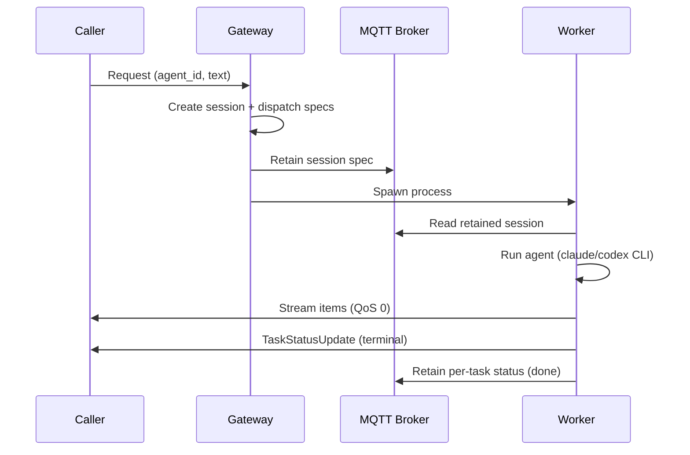
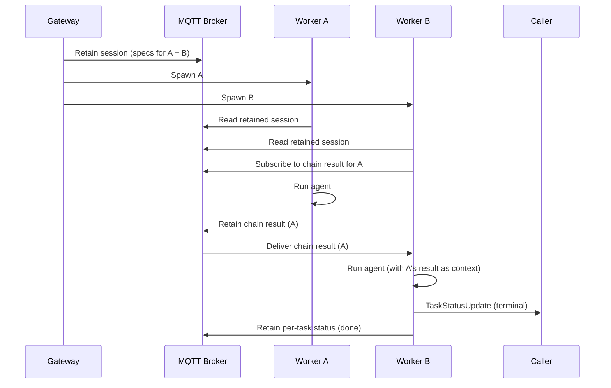
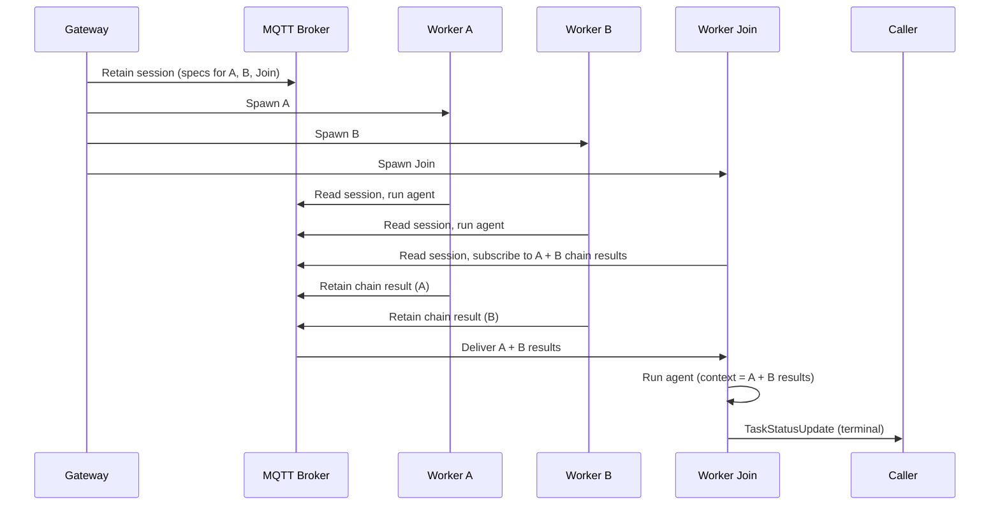

# Skitter Architecture

## Design Principles

1. **Stateless gateway.** The gateway makes no AI calls. It creates sessions with pre-materialized dispatch specs for every task, publishes the session as a retained MQTT message, and spawns all workers upfront. No dispatch loop, no join accumulation, no state tracking.

2. **Self-coordinating workers.** Workers read their spec from the retained session message, wait for upstream chain results if they have `needs`, run the agent, and publish results. No supervisor dispatches tasks -- workers coordinate among themselves via retained MQTT messages.

3. **Chain-based routing.** Non-terminal workers publish retained chain results. Downstream workers with `needs` subscribe to upstream chain result topics and block until all inputs arrive. Terminal workers publish results directly to the caller.

4. **Immutable session spec.** The retained session message is written once by the gateway and never modified. Per-task status is published to separate retained topics (`task/{session_id}/{task_id}`). The dashboard merges per-task status over the session spec.

5. **MQTT v5 as the backbone.** The broker is the single source of truth. Retained messages = durable state, LWT = crash detection, pub/sub = decoupled fan-out.

6. **A2A-over-MQTT.** All topics follow the A2A draft v0.1 scheme. Agents are discoverable via retained Agent Cards. Requests use JSON-RPC 2.0 envelopes with v5 correlation.

7. **QA is a workflow concern.** The gateway has no built-in QA logic. If you want fact-checking or review, add a reviewer task node to your workflow that depends on the work task.

8. **Multi-runtime workers.** Workers invoke `claude` or `codex` as CLI subprocesses, parsing JSONL stdout for streaming events. No SDK imports in the worker process.

## A2A Topic Scheme

```
$a2a/v1/
  discovery/{org}/{unit}/{agent_id}                  # Retained Agent Cards
  discovery/{org}/{unit}/workflow/{workflow_id}       # Retained Workflow Cards
  request/{org}/{unit}/{agent_id}                    # Requests (incl. gateway)
  request/{org}/{unit}/{agent_id}/cancel             # Cancel signal for agent
  reply/{org}/{unit}/{agent_id}/{suffix}             # Replies (Response Topic)
  event/{org}/{unit}/{agent_id}/{event_type}         # Agent events (alive/done/dead)
  state/{org}/{unit}/sessions/{session_id}           # Retained session spec (immutable)
  state/{org}/{unit}/task/{session_id}/{task_id}     # Retained per-task status
  state/{org}/{unit}/chain/{session_id}/{task_id}    # Retained chain results
  state/{org}/{unit}/usage/{session_id}/{task_id}    # Usage tracking
  control/{org}/{unit}/reload                        # Reload agents/workflows signal
```

Default `{org}` = `skitter`, `{unit}` = `default` (configurable via `SKITTER_A2A_ORG` / `SKITTER_A2A_UNIT`).

## Chain-Based Execution

### Simple Chain (single agent)



### Linear Workflow (A -> B)



### Fan-in Join (A + B -> Join)



All workers are spawned immediately. Entry tasks (no `needs`) start work right away. Join tasks block on `wait_for_needs()`, subscribing to upstream chain result topics until all inputs arrive via MQTT retained messages.

### Direct-to-Caller Streaming

Workers stream `StreamItem` directly to the caller's Response Topic (QoS 0), bypassing the gateway entirely.

## Gateway

The gateway (`skitter/gateway.py`) is a long-lived MQTT subscriber that:

1. Subscribes to `$a2a/v1/request/{org}/{unit}/gateway`
2. On inbound request: creates a `Session` with `SessionTask` entries and pre-materialized `task_dispatches` dict
3. Publishes the session as a retained message on `state/{org}/{unit}/sessions/{session_id}`
4. Spawns all workers (subprocess or Docker) -- every task gets a worker immediately
5. Subscribes to `event/+/dead` for crash detection and respawns dead workers

The gateway holds no in-memory state about running sessions. It is restartable at any time.

## Worker Self-Coordination

Each worker (`skitter/worker.py`) runs as an independent process:

1. Connect to MQTT with LWT on `event/{agent_id}/dead`
2. Read the retained session spec from `state/{org}/{unit}/sessions/{session_id}`
3. Find own task by `task_id` in the session's `tasks` dict
4. Read dispatch spec from `session.task_dispatches[task_name]`
5. If task has `needs`: subscribe to upstream `chain/{session_id}/{upstream_task_id}` topics, block until all arrive
6. Build `AgentMessage` from spec + upstream context
7. Run agent as CLI subprocess (`claude` or `codex`), parse JSONL stdout
8. Publish result:
   - Non-terminal: retain chain result on `chain/{session_id}/{task_id}`
   - Terminal: publish `TaskStatusUpdate` to caller's Response Topic
9. Publish per-task status (retained) on `task/{session_id}/{task_id}`
10. Announce done, disconnect

## Workflow Templates

```yaml
# ~/.skitter/workflows/deep-research.yaml
name: Deep Research
description: Multi-source research with fact-checking
variables:
  - topic
tasks:
  - id: research_web
    agent: researcher
    description: "Research '{topic}' using web sources."
    next: fact_check
    needs: []
  - id: research_academic
    agent: researcher
    description: "Research '{topic}' focusing on academic papers."
    next: fact_check
    needs: []
  - id: fact_check
    agent: reviewer
    description: "Cross-reference findings about '{topic}'."
    next: synthesize
    needs: [research_web, research_academic]
  - id: synthesize
    agent: writer
    description: "Combine all findings about '{topic}'."
    next: output
    needs: [fact_check]
```

`next` is auto-inferred from the reverse dependency graph if absent.

## Agent Definitions

```yaml
# ~/.skitter/agents/researcher.yaml
name: Research Specialist
description: Deep research with source citation
soul: |
  You are a research specialist.
skills: |
  Search broadly before going deep.
model: sonnet
max_turns: 15
runtime: claude    # "claude" or "codex"
workspace: ""      # custom cwd (default: ~/.skitter/workspaces/{task_id})
```

## CLI Runtimes

Workers invoke AI agents as CLI subprocesses:

**Claude** (`runtime: claude`):
- Spawns `claude -p "{description}" --output-format stream-json --verbose --max-turns {n} --dangerously-skip-permissions`
- Appends system prompt (soul + skills + context + budget) via `--append-system-prompt`
- Parses JSONL: `assistant` events for text/tool_use, `result` events for usage/cost

**Codex** (`runtime: codex`):
- Spawns `codex exec --json --full-auto --skip-git-repo-check "{prompt}"` with optional `--model`
- Auth via `OPENAI_API_KEY` env var
- Parses JSONL: `item.completed` for agent messages, `turn.completed` for usage

## Toolsmith Agent

A meta-agent that creates/modifies agent and workflow YAML definitions at runtime:
- Works in `~/.skitter/` directory
- After writing files, runs `python -m skitter.reload` to notify the gateway
- Gateway re-reads all YAML files and re-publishes discovery cards

## Recovery

**Gateway crash:** The gateway is stateless. On restart it re-publishes discovery cards and resumes listening. It does not need to recover sessions -- all session state lives in retained MQTT messages, and workers are self-coordinating.

**Worker crash:** LWT fires on `event/{agent_id}/dead`. The gateway receives the dead event and respawns the worker. The new worker reads the same retained session spec, waits for any upstream results (which may already be retained on the broker), and re-runs the task from scratch.

**Broker restart:** Sessions and chain results are lost (retained messages are in-memory by default). Planned: persist sessions to `~/.skitter/` for durability beyond broker restarts.

## Worker Execution Modes

Workers can run as local subprocesses (default) or Docker containers (`SKITTER_SPAWN_MODE=docker`). Docker mode passes both `ANTHROPIC_API_KEY` and `OPENAI_API_KEY` as env vars and connects to the `skitter` Docker network.

## Cancel via A2A

Cancel signals are published as JSON-RPC to `$a2a/v1/request/{org}/{unit}/{agent_id}/cancel`. Workers run a separate cancel listener that watches for cancel messages matching their `task_id` and terminates the agent subprocess.

## EMQX Rule Engine

Auxiliary concerns (logging, webhooks, dead-letter routing, metrics) are handled by EMQX rules rather than application code. See `docs/emqx-rules.md`.
