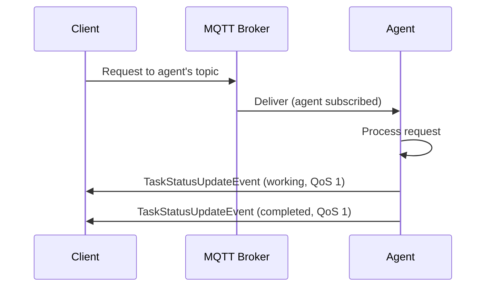
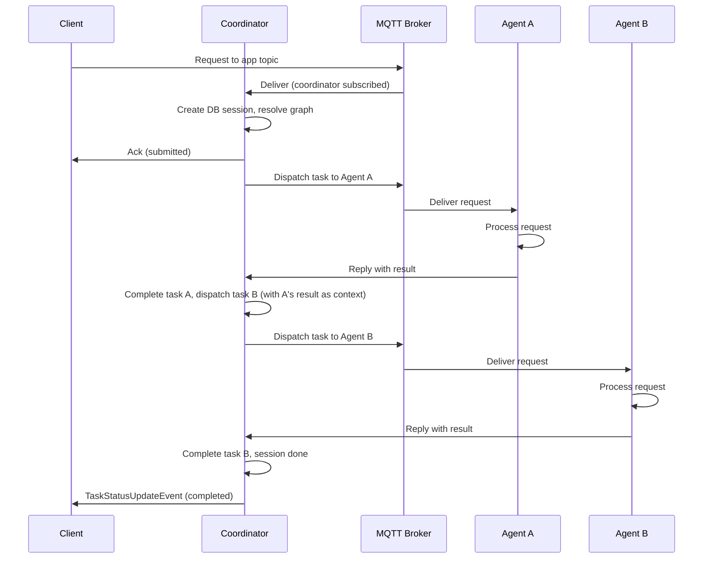
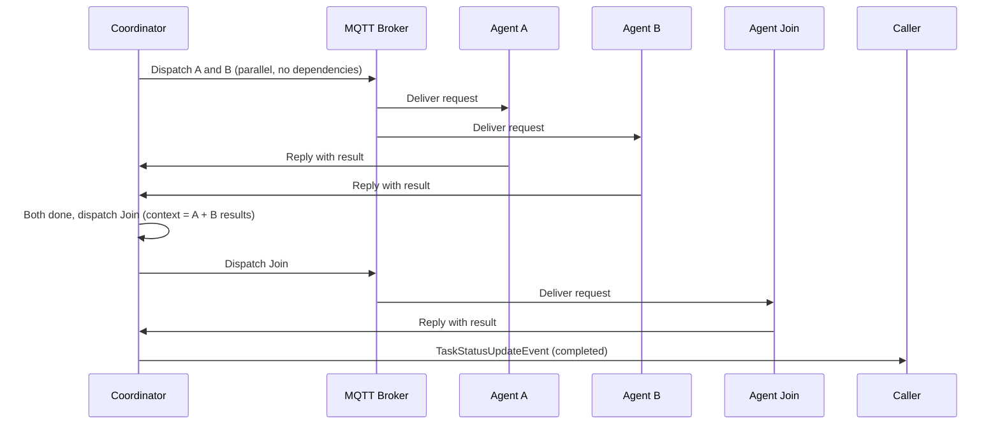
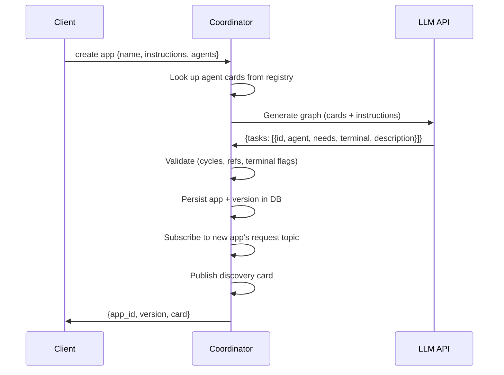

# Skitter Architecture

## Design Principles

1. **Agents are independent A2A-over-MQTT services.** Any process that speaks A2A-over-MQTT can participate as an agent: publish a discovery card, subscribe to its request topic, reply with `TaskStatusUpdateEvent`. Started out of band (manually, via systemd, Docker, Fly). The coordinator just sees A2A agents on the broker. Skitter ships an agent-runner as a convenience for wrapping CLI tools (Claude, Codex), but it's not required.

2. **Coordinator is a pure A2A orchestrator.** It publishes A2A requests and collects A2A replies. It doesn't know how agents are implemented, doesn't spawn processes, and doesn't import agent-runner code. Whether an agent is a CLI wrapper, a custom Python service, or a third-party A2A implementation is an operational concern.

3. **Card ownership follows service ownership.** Individual agents publish their own retained discovery cards via their main MQTT connection. Composed app cards are published by the coordinator. Liveness is tracked separately via LWT.

4. **DB-backed sessions.** Sessions and task state are persisted to SQLite (local) or PostgreSQL (production). On restart, the coordinator rehydrates inflight sessions and resubscribes to reply topics.

5. **Write-ahead dispatch.** The coordinator persists `request_id`, `reply_topic`, `dispatched_at` before sending A2A requests. On crash recovery, it rebuilds session state from task rows.

6. **MQTT v5 as the backbone.** The broker handles routing, fan-out, and liveness tracking. Retained messages for discovery cards. LWT for crash detection. Agents and the coordinator only need outbound connectivity to the broker; they do not need public ingress endpoints.

7. **A2A-over-MQTT.** Topics follow the A2A-over-MQTT v0.1 scheme, referencing A2A v1.0.0. Requests are JSON-RPC 2.0 (`SendMessage`). Replies are `TaskStatusUpdateEvent`. MQTT v5 Response Topic + Correlation Data for reply routing. Task.id (requester-generated UUIDv4) tracks task state across retries.

## Topic Scheme

All topics use the `$a2a` namespace following the A2A-over-MQTT scheme (see `docs/spec/a2a-over-mqtt-transport.md`).

### A2A topics

```
$a2a/v1/
  discovery/{org}/{unit}/{agent_id}          # Retained Agent/App Cards
  request/{org}/{unit}/{agent_id}            # Requests
  reply/{org}/{unit}/{agent_id}/{suffix}     # Replies (Response Topic)
  event/{org}/{unit}/{agent_id}              # Session lifecycle + agent LWT (alive/dead)
```

Default `{org}` = `skitter`, `{unit}` = `default` (configurable via `SKITTER_A2A_ORG` / `SKITTER_A2A_UNIT`).

### Coordinator subscriptions

The coordinator subscribes only to topics it owns, never using wildcard on requests:

| Topic | Purpose |
|-------|---------|
| `$a2a/v1/discovery/{org}/{unit}/+` | Agent discovery (registry) |
| `$a2a/v1/request/{org}/{unit}/skitter` | Runtime API (queries, app creation) |
| `$a2a/v1/request/{org}/{unit}/{app_id}` | Per-app request topics (one per DB app) |
| `$a2a/v1/reply/{org}/{unit}/skitter/#` | Replies to dispatched tasks |

When a new app is created, the coordinator subscribes to its request topic dynamically. Clients talk to standalone agents directly, with no coordinator involvement.

## Execution Flows

### Standalone Agent Request



No coordinator. The agent handles the full request lifecycle.

### Composed App Request (Linear: A → B)



### Composed App Request (Fan-in: A + B → Join)



Tasks with no `needs` are dispatched immediately (parallel fan-out). Tasks with `needs` wait until all upstream results arrive. The coordinator manages the dependency resolution loop.

### App Creation



## Coordinator

The coordinator (`skitter/coordinator/`) is a long-lived process that:

1. Publishes its own discovery card (`skitter`) for runtime API access
2. Subscribes to discovery (agent registry), runtime API requests, and per-app request topics
3. On startup: recovers app subscriptions + republishes discovery cards, rehydrates inflight sessions from DB
4. On app request: creates a DB session with task graph, dispatches ready tasks, resolves dependencies as replies arrive
5. On reply: completes/fails tasks, propagates failures, dispatches newly ready tasks, finalizes sessions
6. On runtime query: handles `list apps`, `get session`, `cancel session`, `create app`, etc.

### Session State

In-memory `SessionState` tracks pending/inflight/completed/failed tasks. DB is the source of truth; on crash, sessions are rebuilt from task rows.

### Failure Handling

- Task failure propagates to all transitively dependent tasks
- If any inflight task remains after a failure, the session waits; otherwise it fails immediately
- Recovered inflight tasks get a 120s timeout. If no reply arrives, the task is failed

## Agent Runner (built-in convenience)

The agent-runner (`skitter/agent_runner.py`) is a convenience wrapper that turns CLI tools into A2A-over-MQTT agents. It is not required; any process that speaks A2A-over-MQTT can participate as an agent.

What it does:

1. Reads metadata from a native CLI definition file (`.md` or `.toml`)
2. Connects to MQTT, subscribes to its request topic
3. Publishes retained discovery card
4. On request: runs the CLI tool as a subprocess, streams events back to caller
5. Handles `CancelTask`: kills the subprocess, replies with `canceled` state
6. Validates Task.id presence; rejects requests without it
7. Deduplicates by Task.id (in-memory, 5-minute TTL); returns existing task state on duplicates
8. Captures CLI-native session ID (`session_id` from Claude, `thread_id` from Codex) and maps it to the A2A `context_id` for multi-turn resume

The agent-runner reads metadata from native definition files and delegates execution to the respective CLI tool. Claude agents are references to registered agent names (resolved by `claude --agent <name>`). Codex agents carry their instructions inline (passed via `codex exec -c developer_instructions=...`). Runtime is inferred from the file extension.

Permissions and isolation:
- **Claude agents**: `--permission-mode auto` with filesystem sandbox (writes restricted to `/tmp`). On resume, `--permission-mode` and `--settings` are omitted (inherited from the original session).
- **Codex agents**: `--full-auto` (workspace-write sandbox), `--ephemeral`, `approval_policy=never`

## Runtime API

The `skitter` agent handles structured queries:

| Command | Description |
|---------|-------------|
| `list apps` | All apps with current version info |
| `get app {id}` | App details + version history |
| `list sessions [app_id]` | Sessions, optionally filtered by app |
| `get session {id}` | Session with all task states |
| `cancel session {id}` | Cancel a running session |
| `create app {json}` | Create composed app from agent IDs + instructions |
| `delete app {id}` | Delete an app and all its versions, sessions, and tasks |

Session lifecycle events are published on `$a2a/v1/event/{org}/{unit}/skitter` for external consumers (e.g., dashboards).

## Database

`DB` protocol in `skitter/db.py` with two backends sharing a `_BaseDB` implementation (SQLite and PostgreSQL subclasses provide only `_exec`, `_fetchone`, `_fetchall`):

- **SQLite**: default, zero config, WAL mode. Good for local/single-instance.
- **PostgreSQL**: for high query volume. Note: only one coordinator instance per broker is supported (enforced via a retained MQTT lock message on startup).

`AsyncDB` wraps any sync backend via `asyncio.to_thread()` so the coordinator never blocks the event loop on DB calls. JSON fields (`variables`, `needs`) are encoded/decoded at the repository boundary; the coordinator works with Python dicts and lists.

Schema: `app` → `app_version` → `session` → `task`. Plain SQL, no ORM.

## Graph Generation

`skitter/graph_gen.py` generates orchestration graphs from natural language:

This path is only used for composed apps. It requires coordinator LLM configuration (model, API, and key in `~/.skitter/config.yaml` or via env vars).

1. Build prompt from agent capabilities (discovery cards) + user instructions
2. Call LLM via `skitter/llm.py` (direct Anthropic/OpenAI SDK wrapper)
3. Validate: agent refs, task ID uniqueness, cycles (DFS on `needs` edges), at least one `terminal: true` node, terminal nodes have no dependents
4. Retry once on validation failure (include error in prompt)

## Recovery

**Coordinator crash:** On restart, recovers from DB: resubscribes to app request topics, republishes discovery cards, rehydrates inflight sessions, dispatches ready tasks.

**Agent crash:** The agent's LWT publishes a `dead` event. The retained discovery card stays on the broker but the agent is no longer listening. Inflight tasks dispatched to the agent will time out and fail. The coordinator propagates the failure to dependent tasks.

**Broker restart:** Discovery cards are lost. Agents republish cards on reconnect. DB-backed session state survives broker restarts.

## Configuration

```yaml
# ~/.skitter/config.yaml
db:
  backend: sqlite              # or "postgres"
  sqlite_path: ~/.skitter/skitter.db
  postgres_dsn: postgresql://...

llm:
  api: anthropic
  model: claude-sonnet-4-6           # for graph generation
```

Environment variables: `MQTT_BROKER_URL`, `MQTT_USERNAME`, `MQTT_PASSWORD`, `MQTT_CA_CERT`, `SKITTER_A2A_ORG`, `SKITTER_A2A_UNIT`, `SKITTER_LLM_API_KEY`, `SKITTER_LLM_API`, `SKITTER_LLM_MODEL`, `SKITTER_LLM_BASE_URL`, `SKITTER_REPLY_FIRST_TIMEOUT`, `SKITTER_STREAM_IDLE_TIMEOUT`, `SKITTER_MAX_ATTEMPTS`, `SKITTER_AGENT_MAX_CONCURRENT`.

## Task.id Lifecycle

Every A2A request carries a `Task.id` (UUIDv4) in `params.message.taskId`, generated by the requester.

1. **Requester** generates a Task.id and includes it in the `SendMessage` payload
2. **Responder** echoes the Task.id in all `TaskStatusUpdateEvent` replies
3. **Retries** reuse the same Task.id with new MQTT Correlation Data
4. **Deduplication**: responders track completed Task.ids and return existing task state on duplicates (per A2A-over-MQTT spec)
5. **Coordinator sessions**: the coordinator generates an internal session ID (UUIDv4) and tracks the incoming Task.id separately as `request_task_id` for dedup and wire replies; dispatched sub-tasks get their own UUIDv4 Task.ids

Validation: both agent-runner and coordinator reject requests with missing Task.id (`transport_protocol_error`, code -32005).

## Requester Retry/Timeout Profile

`send_and_wait()` in `skitter/a2a.py` implements the spec-mandated retry profile:

| Parameter | Default | Env var |
|-----------|---------|---------|
| First reply timeout | 15s | `SKITTER_REPLY_FIRST_TIMEOUT` |
| Stream idle timeout | 30s | `SKITTER_STREAM_IDLE_TIMEOUT` |
| Max attempts | 3 | `SKITTER_MAX_ATTEMPTS` |

Behavior: publish request, wait for first correlated reply. On timeout, retry with new Correlation Data (same Task.id). After first reply, switch to stream idle timeout. Replies with unknown Correlation Data are ignored. Exponential backoff with jitter between retries (1s, 2s, 4s base).
