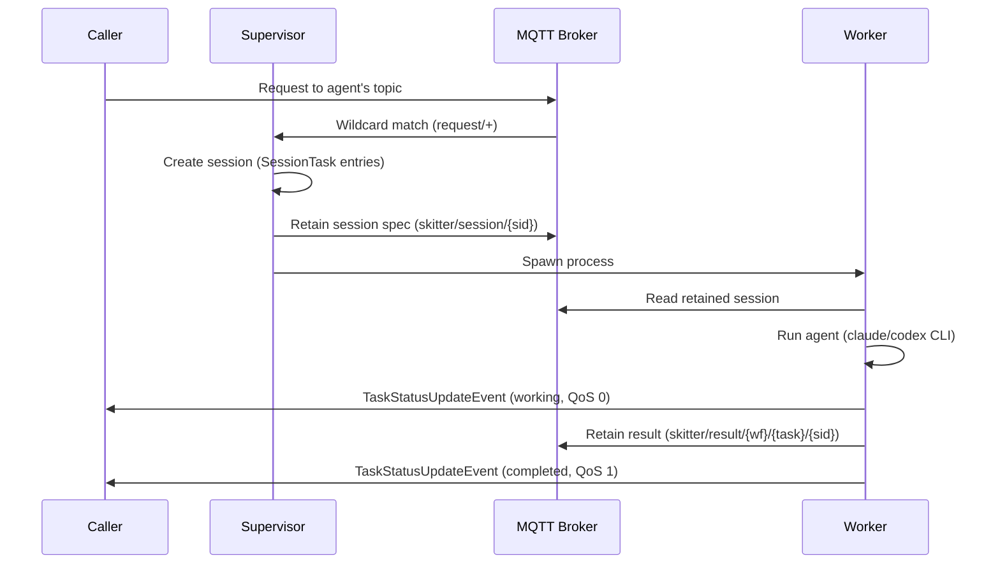
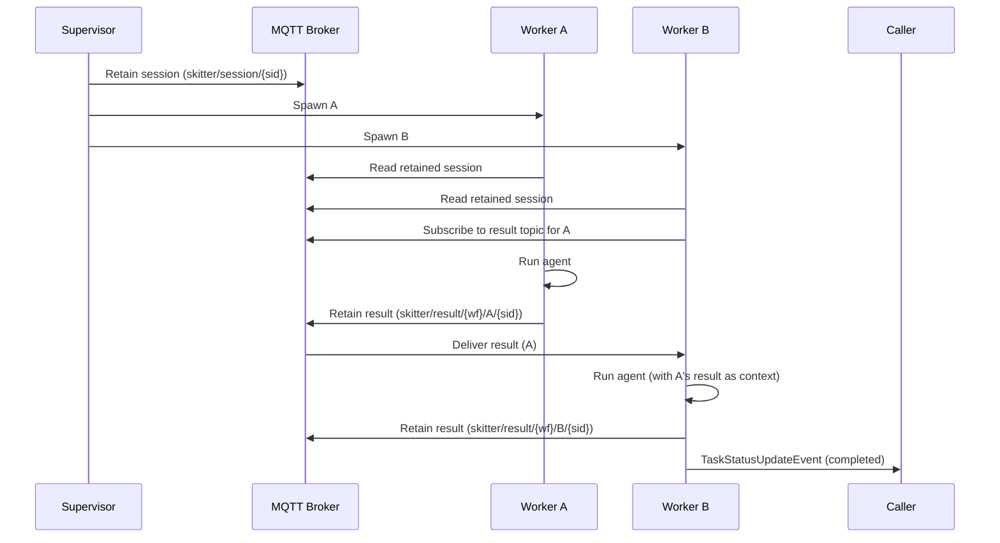
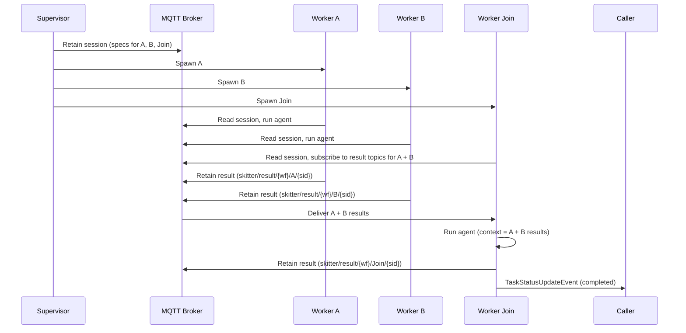

# Skitter Architecture

## Design Principles

1. **Stateless supervisor.** The supervisor makes no AI calls. It listens on wildcard topics (`$a2a/v1/request/{o}/{u}/+` and `skitter/event/+/dead`), creates sessions with `SessionTask` entries for every task, publishes the session as a retained MQTT message, and spawns all workers upfront. No dispatch loop, no join accumulation, no state tracking.

2. **Agents as A2A endpoints.** Clients address agents directly via `$a2a/v1/request/{org}/{unit}/{agent_id}`. The supervisor intercepts via wildcard subscription — invisible infrastructure.

3. **Self-coordinating workers.** Workers read their spec from the retained session message, wait for upstream chain results if they have `needs`, run the agent, and publish results. No supervisor dispatches tasks -- workers coordinate among themselves via retained MQTT messages.

4. **Chain-based routing.** Non-terminal workers publish retained chain results to suffixed event topics. Downstream workers with `needs` subscribe to upstream chain result topics and block until all inputs arrive. Terminal workers publish results directly to the caller.

5. **Immutable session spec.** The retained session message is written once by the supervisor and never modified. Per-task status is published to separate retained topics (`skitter/status/{workflow_id}/{task}/{sid}`). The dashboard merges per-task status over the session spec.

6. **MQTT v5 as the backbone.** The broker is the single source of truth. Retained messages = durable state, LWT = crash detection, pub/sub = decoupled fan-out.

7. **A2A-over-MQTT.** All topics follow the A2A draft v0.1 scheme with application-defined suffixes after the agent ID. Agents and workflows are discoverable via retained discovery cards, auto-generated from YAML definitions (`skitter publish`). Requests are JSON-RPC 2.0 (`tasks/send`). Replies are `TaskStatusUpdateEvent` JSON-RPC responses. MQTT v5 Response Topic + Correlation Data for reply routing.

8. **QA is a workflow concern.** The supervisor has no built-in QA logic. If you want fact-checking or review, add a reviewer task node to your workflow that depends on the work task.

9. **Multi-runtime workers.** Workers invoke `claude` or `codex` as CLI subprocesses, parsing JSONL stdout for streaming events. No SDK imports in the worker process.

## Topic Scheme

Skitter uses two namespaces: `$a2a` for the standard A2A protocol (client-facing) and `skitter` for internal coordination.

### A2A topics (client-facing)

```
$a2a/v1/
  discovery/{org}/{unit}/{agent_id}          # Retained Agent/Workflow Cards
  request/{org}/{unit}/{agent_id}            # Requests (clients address agents directly)
  request/{org}/{unit}/{agent_id}/cancel     # Cancel signal for agent
  reply/{org}/{unit}/{agent_id}/{suffix}     # Replies (Response Topic)
```

Default `{org}` = `skitter`, `{unit}` = `default` (configurable via `SKITTER_A2A_ORG` / `SKITTER_A2A_UNIT`).

### Skitter internal topics

```
skitter/
  session/{session_id}                       # Retained session spec (immutable)
  result/{workflow_id}/{task}/{session_id}   # Retained inter-worker results
  status/{workflow_id}/{task}/{session_id}   # Retained per-task status
  usage/{workflow_id}/{task}/{session_id}    # Usage tracking
  event/{agent}/{type}                       # alive/dead (LWT)
  control/reload                             # Reload agents/workflows signal
```

The `skitter` namespace has no `{org}/{unit}` segments — it is internal infrastructure, not part of the A2A addressing scheme. `workflow_id` equals `agent_id` for single-agent sessions.

The supervisor subscribes to `$a2a/v1/request/{o}/{u}/+` (wildcard for all agent requests), `skitter/event/+/dead` (worker crash detection), and `skitter/control/reload`.

## Chain-Based Execution

### Simple Chain (single agent)



### Linear Workflow (A -> B)



### Fan-in Join (A + B -> Join)



All workers are spawned immediately. Entry tasks (no `needs`) start work right away. Join tasks block on `wait_for_needs()`, subscribing to upstream result topics until all inputs arrive via MQTT retained messages.

### Direct-to-Caller Streaming

Workers stream `TaskStatusUpdateEvent` (state `working`) directly to the caller's Response Topic (QoS 0), bypassing the supervisor entirely.

## Supervisor

The supervisor (`skitter/supervisor.py`) is a long-lived MQTT subscriber that:

1. Subscribes to `$a2a/v1/request/{org}/{unit}/+` (wildcard for all agent requests)
2. Subscribes to `skitter/event/+/dead` (worker crash detection)
3. Subscribes to `skitter/control/reload`
4. On inbound request: extracts `agent_id` from the topic, creates a `Session` with `SessionTask` entries (each carrying its `runtime` and other orchestration metadata)
5. Publishes the session as a retained message on `skitter/session/{session_id}`
6. Spawns all workers (subprocess, Docker, or Fly Machines) -- every task gets a worker immediately
7. Listens for dead events and respawns crashed workers (local/docker only — skipped on Fly)

The supervisor holds no in-memory state about running sessions. It is restartable at any time.

## Worker Self-Coordination

Each worker (`skitter/worker.py`) runs as an independent process:

1. Connect to MQTT with LWT on `skitter/event/{agent}/dead`
2. Read the retained session spec from `skitter/session/{session_id}`
3. Find own task by task name (`(session_id, task_name)` is the composite key)
4. If task has `needs`: subscribe to upstream `skitter/result/{workflow_id}/{upstream_task}/{sid}` topics, block until all arrive
5. Build prompt from task spec + upstream context
6. Run agent as CLI subprocess (`claude` or `codex`), parse JSONL stdout
7. Publish result:
   - All tasks: retain result on `skitter/result/{workflow_id}/{task}/{sid}` (durable state for dashboard and downstream workers)
   - Terminal tasks also: publish `TaskStatusUpdateEvent` (completed) to caller's Response Topic
8. Publish usage stats, disconnect

## Workflow Templates

```yaml
# ~/.skitter/workflows/deep-research.yaml
name: Deep Research
description: Multi-source research with fact-checking
variables:
  - topic
tasks:
  - id: research_web
    agent: researcher
    description: "Research '{topic}' using web sources."
    next: fact_check
    needs: []
  - id: research_academic
    agent: researcher
    description: "Research '{topic}' focusing on academic papers."
    next: fact_check
    needs: []
  - id: fact_check
    agent: reviewer
    description: "Cross-reference findings about '{topic}'."
    next: synthesize
    needs: [research_web, research_academic]
  - id: synthesize
    agent: writer
    description: "Combine all findings about '{topic}'."
    next: output
    needs: [fact_check]
```

`next` is auto-inferred from the reverse dependency graph if absent.

## Agent Definitions

```yaml
# ~/.skitter/agents/researcher.yaml
name: Research Specialist
description: Deep research with source citation
runtime: claude    # "claude" or "codex"
workspace: ""      # custom cwd (default: ~/.skitter/workspaces/{task})
```

Agent identity (personality, model, tools, memory) is owned by native CLI sub-agent systems (`~/.claude/agents/*.md` for Claude, `~/.codex/agents/*.toml` for Codex), not skitter. The YAML stub contains only orchestration metadata.

## CLI Runtimes

Workers invoke AI agents as CLI subprocesses:

**Claude** (`runtime: claude`):
- Spawns `claude -p "{description}" --output-format stream-json --verbose --max-turns {n} --dangerously-skip-permissions`
- Appends upstream context via `--append-system-prompt`
- Parses JSONL: `assistant` events for text/tool_use, `result` events for usage/cost

**Codex** (`runtime: codex`):
- Spawns `codex exec --json --full-auto --skip-git-repo-check "{prompt}"` with optional `--model`
- Auth via `OPENAI_API_KEY` env var
- Parses JSONL: `item.completed` for agent messages, `turn.completed` for usage

## Discovery Cards

Discovery cards are auto-generated from agent/workflow YAML definitions and published as retained messages on `$a2a/v1/discovery/{org}/{unit}/{id}`. The dashboard and other clients use these to show available agents and workflows.

- `skitter publish` — build cards from `~/.skitter/agents/*.yaml` and `~/.skitter/workflows/*.yaml`, publish to broker
- The supervisor also publishes cards on startup and on reload (`skitter/control/reload`)
- Standalone agents get individual cards; workflow-only agents are excluded (shown as part of their workflow card)

## Configuration Manager

The default `skitter` agent can create/modify agent and workflow YAML definitions at runtime:
- Works in `~/.skitter/` directory
- After writing files, runs `python -m skitter.reload` to notify the supervisor
- Supervisor re-reads all YAML files and re-publishes discovery cards

## Recovery

**Supervisor crash:** The supervisor is stateless. On restart it re-publishes discovery cards and resumes listening. It does not need to recover sessions -- all session state lives in retained MQTT messages, and workers are self-coordinating.

**Worker crash (local/docker):** LWT fires on `skitter/event/{agent}/dead`. The supervisor receives the dead event and respawns the worker. The new worker reads the same retained session spec, waits for any upstream results (which may already be retained on the broker), and re-runs the task from scratch.

**Worker crash (Fly):** Fly handles restarts via its own restart policy (`on-failure`, `max_retries=1`). The supervisor ignores dead events when `SPAWN_MODE=fly` to avoid conflicting with Fly's restart mechanism.

**Broker restart:** Sessions and chain results are lost (retained messages are in-memory by default). Planned: persist sessions to `~/.skitter/` for durability beyond broker restarts.

## Worker Execution Modes

Workers can run as local subprocesses (default) or Docker containers (`SKITTER_SPAWN_MODE=docker`). Docker mode passes both `ANTHROPIC_API_KEY` and `OPENAI_API_KEY` as env vars and connects to the `skitter` Docker network.

## Cancel via A2A

Cancel signals are published as JSON-RPC to `$a2a/v1/request/{org}/{unit}/{agent_id}/cancel`. Workers run a separate cancel listener that watches for cancel messages matching their session and terminates the agent subprocess.

