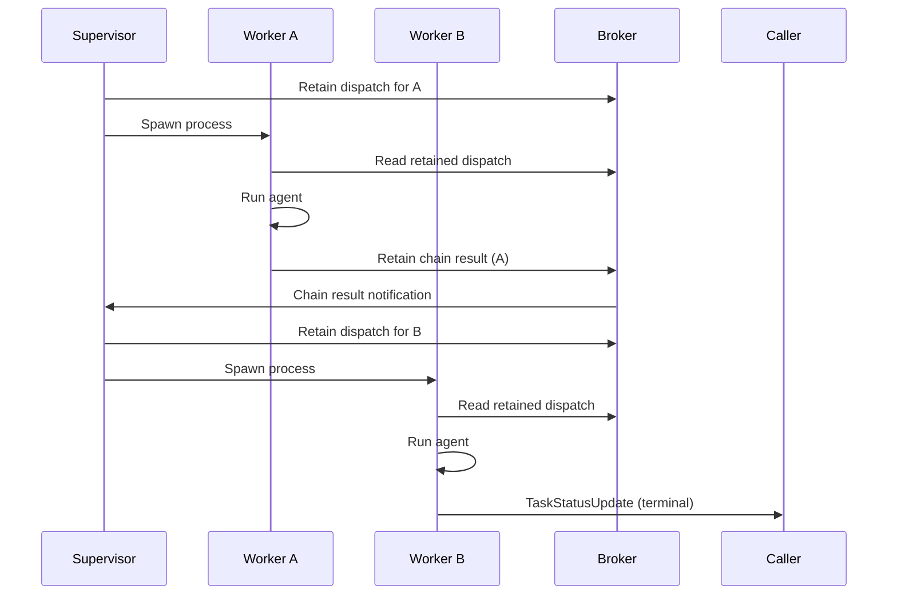
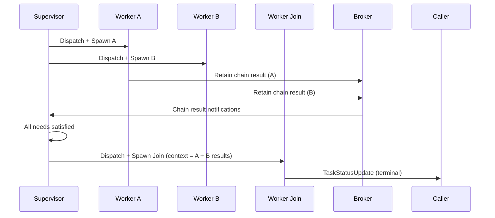
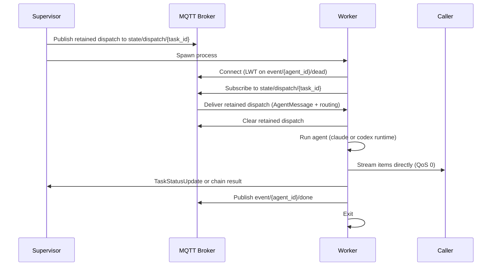

# Skitter Architecture

## Design Principles

1. **Zero-LLM supervisor.** The supervisor makes no AI calls. It spawns workers for entry tasks, handles joins, and respawns on crash. `claude_agent_sdk` is only imported by the worker process.

2. **Chain-based routing.** Workers publish retained chain results for non-terminal tasks. The supervisor dispatches the next task when chain results arrive — immediately for simple chains, after accumulating all inputs for joins.

3. **Stateless supervisor.** All state is derived from retained MQTT messages. If the supervisor crashes, it recovers sessions, chain results, and dispatch state from the broker on restart.

4. **MQTT v5 as the backbone.** The broker is the single source of truth. Retained messages act as durable storage for sessions, chain results, and task dispatch. LWT handles worker crash detection.

5. **A2A-over-MQTT.** All topics follow the A2A draft v0.1 scheme. Agents are discoverable via retained Agent Cards. Requests use JSON-RPC 2.0 envelopes with v5 correlation.

6. **QA is a pipeline concern.** The supervisor has no built-in QA logic. If you want fact-checking or review, add a reviewer task node to your pipeline that depends on the work task.

7. **Multi-runtime workers.** Workers support `claude` (claude-agent-sdk) and `codex` (OpenAI Codex CLI) runtimes, selected per-agent via YAML config.

## A2A Topic Scheme

```
$a2a/v1/
├── discovery/{org}/{unit}/{agent_id}           # Retained Agent Cards
├── request/{org}/{unit}/{agent_id}             # Requests to agents (incl. supervisor)
├── request/{org}/{unit}/{agent_id}/cancel      # Cancel signal for agent
├── reply/{org}/{unit}/{agent_id}/{suffix}      # Replies (Response Topic, per-session)
├── event/{org}/{unit}/{agent_id}/{event_type}  # Agent events (alive/done/dead)
├── state/{org}/{unit}/sessions/{session_id}           # Retained session spec
├── state/{org}/{unit}/dispatch/{task_id}              # Retained task dispatch
├── state/{org}/{unit}/chain/{session_id}/{task_id}   # Retained chain results
├── state/{org}/{unit}/usage/{session_id}/{task_id}   # Usage tracking
└── control/{org}/{unit}/reload                 # Reload agents/pipelines signal
```

Default `{org}` = `skitter`, `{unit}` = `default` (configurable via `SKITTER_A2A_ORG` / `SKITTER_A2A_UNIT`).

## Chain-Based Execution

### Simple Chain (linear pipeline)



Workers publish retained chain results for non-terminal tasks. The supervisor subscribes to chain results via wildcard, finds the next task from the source task's `next` field, and dispatches it.

### Join (fan-in)



When a chain result arrives for a task whose `next` has multiple `needs`, the supervisor accumulates inputs and dispatches the join worker when all inputs are collected.

### Direct-to-Caller Streaming

Workers stream `StreamItem` directly to `task.caller_reply_topic`, eliminating stream forwarding from the supervisor.

## Retained Dispatch

Task dispatch uses retained MQTT messages for crash-proof delivery:



The dispatch payload wraps the `AgentMessage` with coordinator routing info (`reply_topic`, `correlation`). If the supervisor crashes between publish and spawn, the retained dispatch persists on the broker.

## Pipeline Templates

```yaml
# ~/.skitter/pipelines/deep-research.yaml
name: Deep Research
description: Multi-source research with fact-checking
variables:
  - topic
tasks:
  - id: research_web
    agent: researcher
    description: "Research '{topic}' using web sources."
    next: fact_check
    needs: []
  - id: research_academic
    agent: researcher
    description: "Research '{topic}' focusing on academic papers."
    next: fact_check
    needs: []
  - id: fact_check
    agent: reviewer
    description: "Cross-reference findings about '{topic}'."
    next: synthesize
    needs: [research_web, research_academic]
  - id: synthesize
    agent: writer
    description: "Combine all findings about '{topic}'."
    next: output
    needs: [fact_check]
```

`next` is auto-inferred from the reverse dependency graph if absent.

## Agent Definitions

```yaml
# ~/.skitter/agents/researcher.yaml
name: Research Specialist
description: Deep research with source citation
soul: |
  You are a research specialist.
skills: |
  Search broadly before going deep.
model: sonnet
max_turns: 15
runtime: claude    # "claude" or "codex"
workspace: ""      # custom cwd (default: ~/.skitter/workspaces/{task_id})
```

## Codex Runtime

Workers support OpenAI's Codex CLI as an alternative runtime:
- Set `runtime: codex` in agent YAML
- Auth via `OPENAI_API_KEY` env var (inherited by subprocess)
- Spawns `codex exec --json --full-auto "{prompt}"` with optional `--model`
- Parses JSONL stdout for text and tool_use events

## Toolsmith Agent

A meta-agent that creates/modifies agent and pipeline YAML definitions at runtime:
- Works in `~/.skitter/` directory
- After writing files, runs `python -m skitter.reload` to notify the supervisor
- Supervisor re-reads all YAML files and re-publishes Agent Cards

## Recovery

On supervisor restart:
1. Recover sessions from retained `$a2a/v1/state/{org}/{unit}/sessions/+`
2. Recover chain results from retained `$a2a/v1/state/{org}/{unit}/chain/+/+`
3. For tasks with status "running": re-publish retained dispatch, spawn new worker
4. Check if any joins are now satisfiable from recovered chain results
5. Workers re-run tasks from scratch

## Coordinator Class

The supervisor logic is organized as a `Coordinator` class with handler methods:

| Method | Handles |
|---|---|
| `handle_inbound()` | Inbound requests (pipeline/agent/spawn) |
| `handle_chain_result()` | Chain results — marks source done, dispatches next |
| `handle_reply()` | Terminal task bookkeeping, session completion |
| `handle_reload()` | Agent/pipeline reload from disk |
| `handle_event()` | Worker alive/done/dead events |
| `dispatch_task()` | Builds AgentMessage, publishes retained dispatch |
| `dispatch_and_spawn()` | Dispatch + spawn worker subprocess |

## Worker Execution Modes

Workers can run as local subprocesses (default) or Docker containers (`SKITTER_WORKER_MODE=docker`). Docker mode passes both `ANTHROPIC_API_KEY` and `OPENAI_API_KEY` as env vars.

## Cancel via A2A

Cancel signals are published as JSON-RPC to `$a2a/v1/request/{org}/{unit}/{agent_id}/cancel`. Worker subscribes and checks via `pre_tool_use` hook.

## EMQX Rule Engine

Auxiliary concerns (logging, webhooks, dead-letter routing, metrics) are handled by EMQX rules rather than application code. See `docs/emqx-rules.md`.
