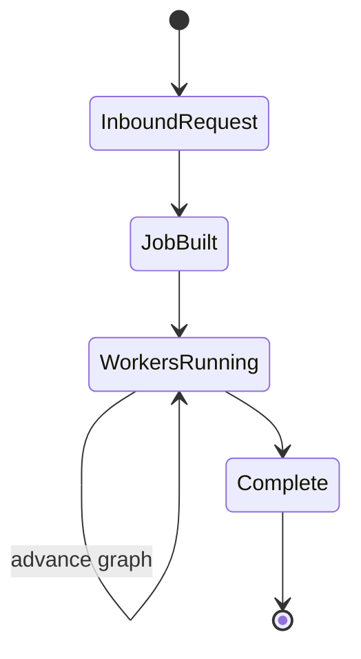
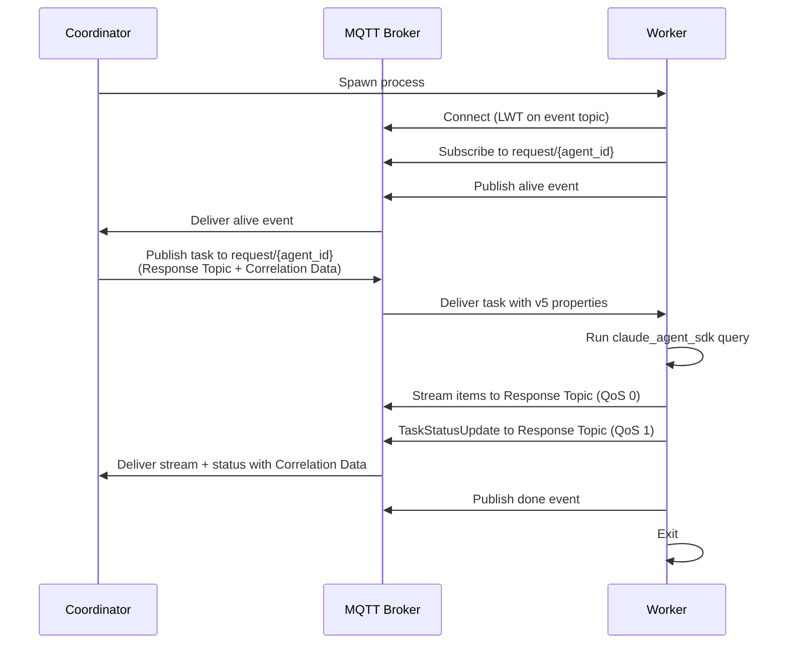
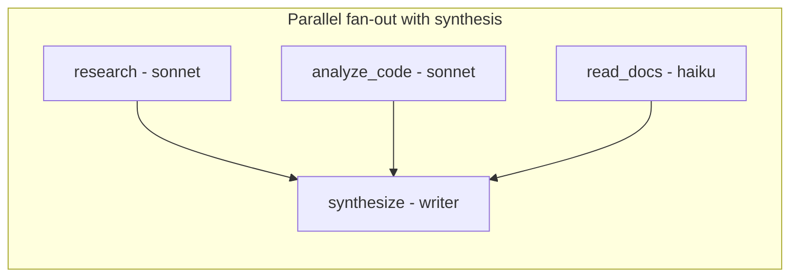
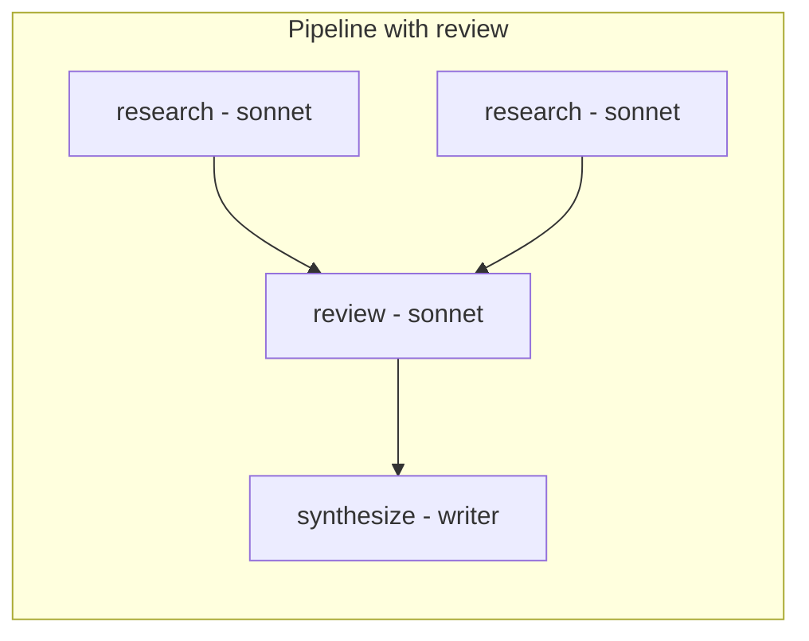

# Skitter Architecture

## Design Principles

1. **Zero-LLM coordinator.** The coordinator makes no AI calls. It is a pure DAG executor — build graph, dispatch tasks, collect results, advance. `claude_agent_sdk` is only imported by the worker process.

2. **Stateless coordinator.** All state is derived from retained MQTT messages. If the coordinator crashes, it recovers jobs from the broker on restart and respawns interrupted workers.

3. **MQTT v5 as the backbone.** The broker is the single source of truth. Retained messages act as durable storage for job specs and Agent Cards. LWT handles worker crash detection. MQTT v5 properties (Response Topic, Correlation Data) enable request/reply patterns without retained task messages.

4. **A2A-over-MQTT.** All topics follow the A2A draft v0.1 scheme. Agents are discoverable via retained Agent Cards. Requests use JSON-RPC 2.0 envelopes with v5 correlation.

5. **QA is a pipeline concern.** The coordinator has no built-in QA logic. If you want fact-checking or review, add a reviewer task node to your pipeline that depends on the work task.

## A2A Topic Scheme

```
$a2a/v1/
├── discovery/{org}/{unit}/{agent_id}           # Retained Agent Cards
├── request/{org}/{unit}/{agent_id}             # Requests to agents (incl. coordinator)
├── request/{org}/{unit}/{agent_id}/cancel      # Cancel signal for agent
├── reply/{org}/{unit}/{agent_id}/{suffix}      # Replies (Response Topic, per-session)
├── event/{org}/{unit}/workers/{task_id}        # Worker liveness (LWT)
├── state/{org}/{unit}/jobs/{chat_id}           # Retained job spec (DAG state)
└── state/{org}/{unit}/usage/{chat_id}/{task_id} # Usage tracking
```

Default `{org}` = `skitter`, `{unit}` = `default` (configurable via `SKITTER_A2A_ORG` / `SKITTER_A2A_UNIT`).

## Request Lifecycle



**States explained:**

- **InboundRequest** — A2A request arrives with `agent_id` (direct call) or `pipeline_id` (DAG execution)
- **JobBuilt** — Task graph is ready (single task for direct call, full DAG for pipeline)
- **WorkersRunning** — Workers execute in parallel; as results arrive, newly unblocked tasks spawn
- **Complete** — All tasks done, result routed to caller's Response Topic

## Alive-Triggered Dispatch

A2A forbids retained request/reply messages. Dispatch uses an alive-triggered handshake:



The coordinator maintains `pending_dispatch: dict[task_id, (job, task)]` — queued until the worker's alive event arrives.

## Token-by-Token Streaming

Workers publish each text delta as a `StreamItem` (QoS 0) to the coordinator's Response Topic with the same Correlation Data. Tool use/result events are also streamed. The terminal `TaskStatusUpdate(state=COMPLETED)` is published at QoS 1.

## DAG Execution

Pipeline templates define task graphs. Tasks with no dependencies run in parallel. Every task — research, review, synthesis — is a regular agent node.



Review, QA, and synthesis are all just pipeline tasks — add them as explicit nodes with dependencies:



## Agent-to-Agent Discovery and Spawn

Agents can discover peers via retained Agent Cards on `$a2a/v1/discovery/{org}/{unit}/+`. An agent can request the coordinator to spawn a peer:

1. Agent publishes `tasks/spawn` request to coordinator's request topic
2. Coordinator spawns the requested agent, dispatches task
3. Result flows back to requesting agent's reply topic

## Worker Workspaces

Each worker gets `~/.skitter/workspaces/{task_id}/` as its working directory. Files persist after completion for downstream agents or users to inspect.

## Agent Cards

On startup, the coordinator publishes Agent Cards (retained) from `~/.skitter/agents/*.yaml`:

```json
{
  "agent_id": "researcher",
  "name": "Research Specialist",
  "description": "Deep research with source citation",
  "capabilities": ["tool_use"],
  "model": "sonnet",
  "max_turns": 15
}
```

## Pipeline Templates

```yaml
# ~/.skitter/pipelines/deep-research.yaml
name: Deep Research
description: Multi-source research with fact-checking
variables:
  - topic
tasks:
  - logical_id: research_web
    agent: researcher
    description: "Research '{topic}' using web sources."
    depends_on: []
  - logical_id: research_academic
    agent: researcher
    description: "Research '{topic}' focusing on academic papers."
    depends_on: []
  - logical_id: fact_check
    agent: reviewer
    description: "Cross-reference findings about '{topic}'."
    depends_on: [research_web, research_academic]
  - logical_id: synthesize
    agent: writer
    description: "Combine all research findings about '{topic}' into a clear, coherent response."
    depends_on: [fact_check]
```

## Recovery

On coordinator restart:
1. Recover job specs from retained `$a2a/v1/state/{org}/{unit}/jobs/+`
2. For tasks with status "running": spawn new worker, queue in `pending_dispatch`, re-dispatch on alive
3. Workers re-run tasks from scratch

## Worker Execution Modes

Workers can run as local subprocesses (default) or Docker containers (`SKITTER_WORKER_MODE=docker`).

## Cancel via A2A

Coordinator publishes JSON-RPC cancel to `$a2a/v1/request/{org}/{unit}/{agent_id}/cancel`. Worker subscribes alongside main request topic and checks via `pre_tool_use` hook.
