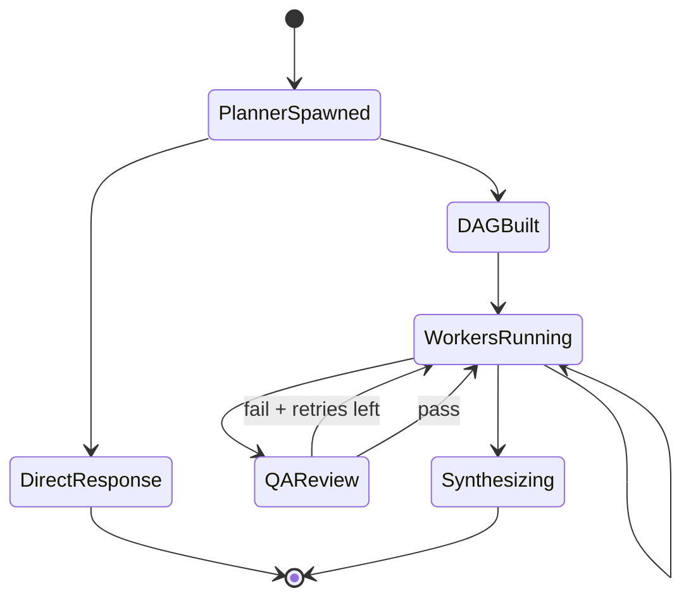
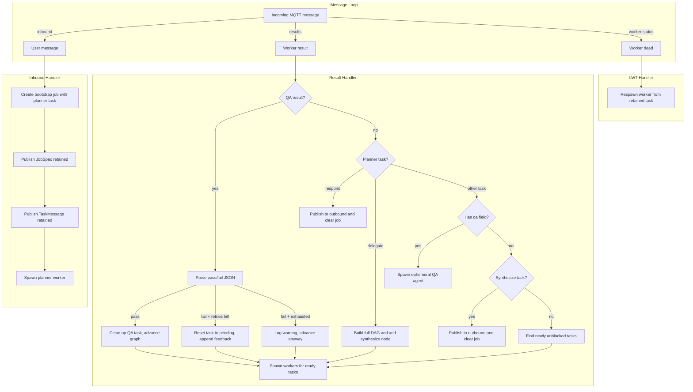
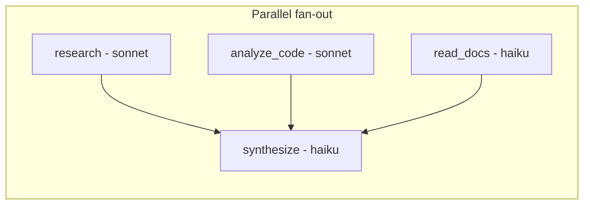
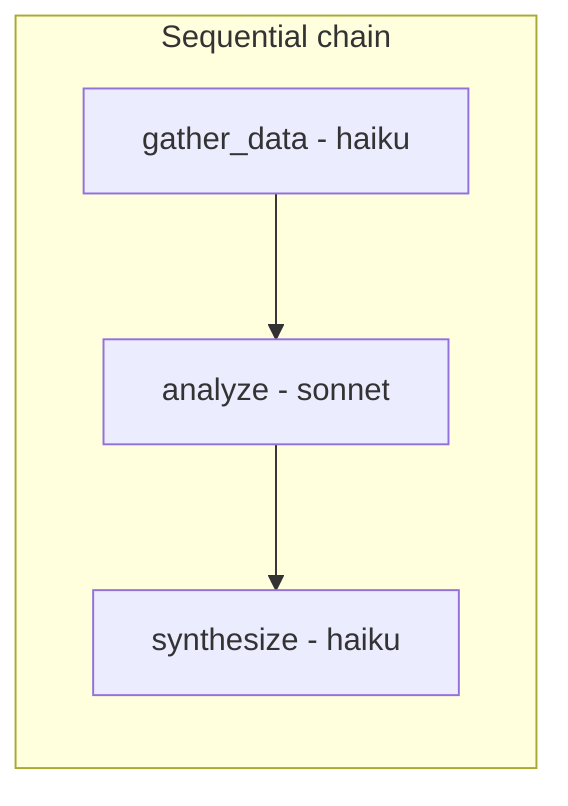
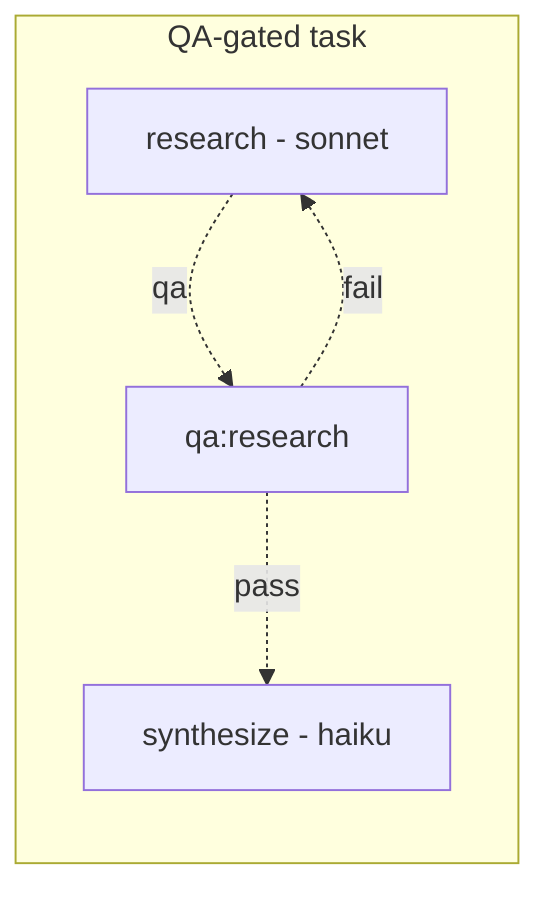
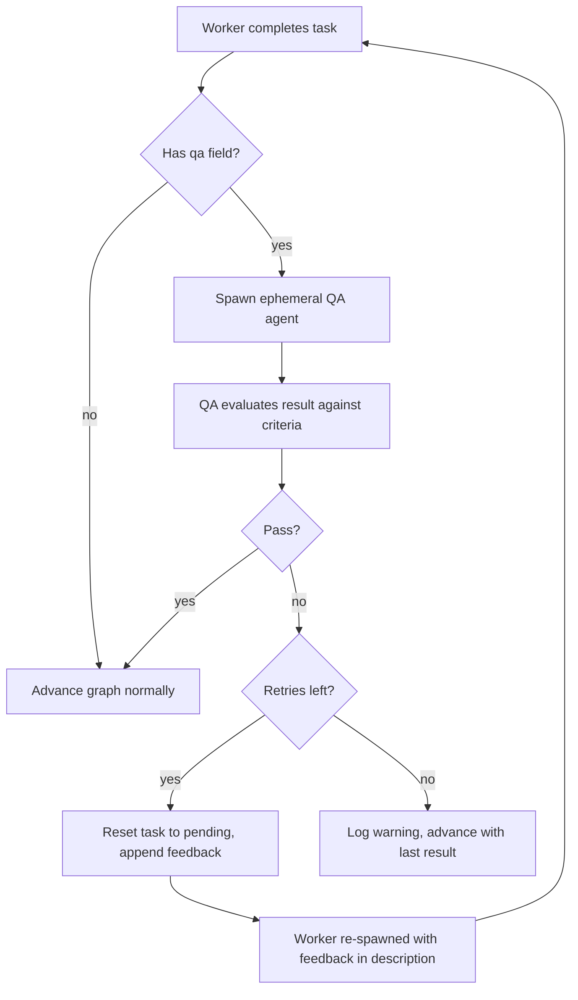
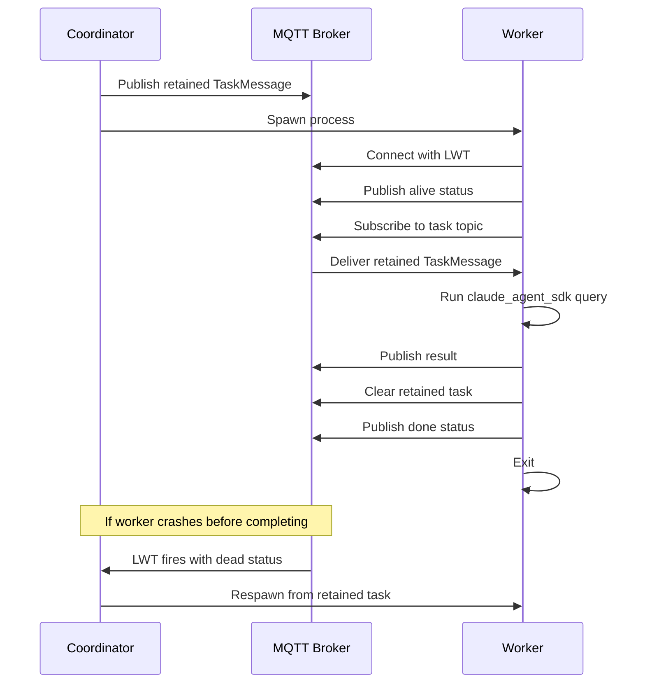
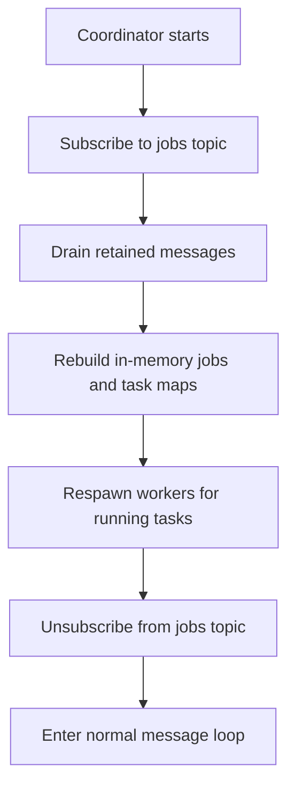

# Skitter Architecture

## Design Principles

1. **Zero-LLM coordinator.** The coordinator makes no AI calls. Planning and synthesis are worker tasks in the DAG. `claude_agent_sdk` is only imported by the worker process.

2. **Stateless coordinator.** All state is derived from retained MQTT messages. If the coordinator crashes, it recovers jobs from the broker on restart and respawns interrupted workers.

3. **MQTT as the backbone.** The broker is the single source of truth. Retained messages act as durable storage for job specs and task assignments. LWT (Last Will and Testament) handles worker crash detection.

## Request Lifecycle



**States explained:**

- **PlannerSpawned** — User publishes to inbound topic, coordinator spawns planner worker
- **DirectResponse** — Planner returns a direct answer, coordinator forwards to outbound
- **DAGBuilt** — Planner returns a task graph, coordinator builds DAG with synthesize node
- **WorkersRunning** — Workers execute in parallel; as results arrive, newly unblocked tasks spawn
- **QAReview** — If a task has QA criteria, an ephemeral QA agent validates the output. On failure, the task retries with feedback
- **Synthesizing** — All workers done, synthesize task combines results into final response

## Coordinator Message Loop

The coordinator subscribes to three topic patterns and reacts to each.



## DAG Execution

A delegated request produces a task graph. Tasks with no dependencies run in parallel. The synthesize node is auto-added as a leaf that depends on all other tasks.



Tasks can also form chains when the planner specifies dependencies.



When a task has a `qa` field, an ephemeral QA agent gates its completion before downstream tasks can proceed.



The coordinator advances the graph with pure logic, with no LLM calls:

1. Mark completed task as "done", store its result
2. If the task has a `qa` field, spawn an ephemeral QA agent instead of advancing (see QA below)
3. Find tasks where all dependencies are "done" and status is "pending"
4. For each: build context from upstream results, publish retained task, spawn worker
5. Re-publish updated job spec

## QA Feedback Loop

The planner can attach a `"qa"` field to any task with criteria for validating the output. When a task with QA completes:



**Details:**

- QA tasks use logical ID `qa:{original_id}` and are ephemeral and don't appear in the synthesize `depends_on` list
- The QA agent gets: the original task description, the worker's output, and the QA criteria. It has no tools (`max_turns=0`) and must return `{"pass":true}` or `{"pass":false,"feedback":"..."}`
- On failure, the coordinator increments `retries`, appends feedback to the task description, resets the task to `"pending"`, and removes the old result. The normal `get_ready_tasks()` logic picks it up and re-spawns the worker
- Default `max_retries` is 2. The planner can override this per task
- If retries are exhausted, the coordinator keeps the last result and advances the graph anyway

### Planner Schema

```json
{
  "logical_id": "research",
  "agent": "researcher",
  "model": "sonnet",
  "description": "Research the topic thoroughly",
  "soul": "You are a research specialist. Cite sources.",
  "skills": "Search broadly, then write a structured summary.",
  "max_turns": 15,
  "qa": "Verify all claims have citations and sources are reputable",
  "max_retries": 3,
  "early_qa_interval": 10,
  "depends_on": []
}
```

Optional fields: `soul`, `skills`, `max_turns` (default 10), `qa`, `max_retries` (default 2), `early_qa_interval` (default 0, disabled). Tasks without `qa` behave exactly as before.

## Worker Lifecycle



## Recovery

On startup, the coordinator recovers from retained MQTT messages.



If a worker completed while the coordinator was down and cleared its retained task, the respawned worker finds no task and exits harmlessly.

## Model Selection

The planner picks a model for each delegated task from a configurable list.

### Configuration

```bash
# Available models (pipe-separated name:description pairs)
SKITTER_MODELS="haiku:Fast and cheap|sonnet:Balanced|opus:Most capable"

# Model for the planner itself
SKITTER_PLANNER_MODEL=opus

# Models for QA and synthesizer
SKITTER_QA_MODEL=sonnet
SKITTER_SYNTH_MODEL=sonnet
```

The model list and descriptions are injected into the planner's system prompt. The planner includes a `"model"` field per task. The coordinator validates the choice against the known list (falls back to the first model if unknown) and passes it through to the worker.

### Typical Assignments

| Task Type | Typical Model | Why |
|-----------|--------------|-----|
| Planner | opus | Routing decisions shape everything downstream — worth the best model |
| Simple file read / summarize | haiku | Fast, cheap, sufficient for extraction |
| Code analysis / complex reasoning | sonnet or opus | Needs stronger capabilities |
| QA | sonnet | Evaluating output quality, moderate reasoning |
| Synthesize | sonnet | Combining and rewriting results coherently |

## Topic Scheme

```
skitter/
├── inbound/{chat_id}                          # User → coordinator
├── outbound/{chat_id}                         # Coordinator → user (retained)
├── jobs/{chat_id}                             # Retained job spec (DAG + results)
├── tasks/{agent}/{chat_id}/{task_id}          # Retained task for worker
├── results/{chat_id}/{task_id}                # Worker result → coordinator
├── workers/{chat_id}/{task_id}/status         # Worker liveness (LWT)
├── usage/{chat_id}/{task_id}                  # Token usage and cost per task
├── stream/{chat_id}/{task_id}                 # Live text/tool chunks from worker
├── stream/{chat_id}/{task_id}/snapshot        # Periodic progress snapshot (retained)
├── feedback/{chat_id}/{task_id}               # QA feedback injected mid-run (retained)
└── cancel/{chat_id}/{task_id}                 # Cancel signal for running worker (retained)
```

The coordinator subscribes at startup to: `skitter/inbound/+`, `skitter/results/+/+`, `skitter/workers/+/+/status`, `skitter/stream/+/+/snapshot`.
