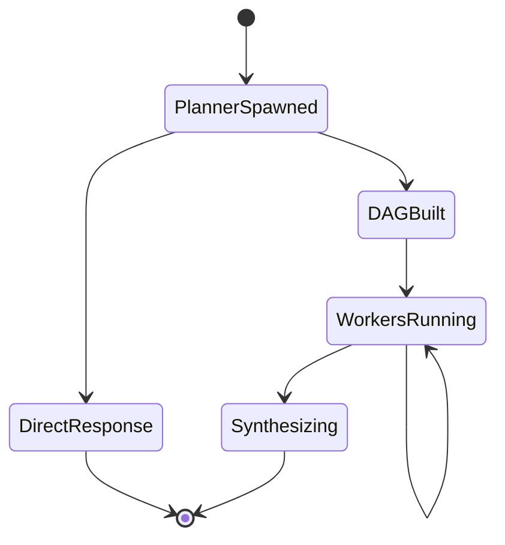
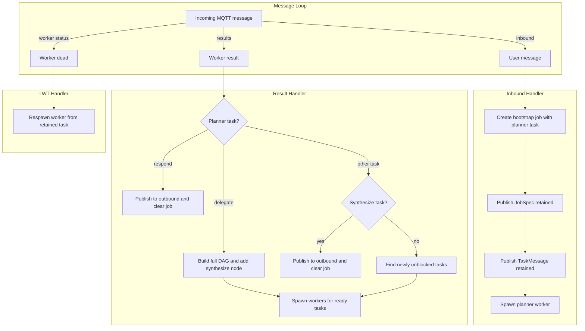
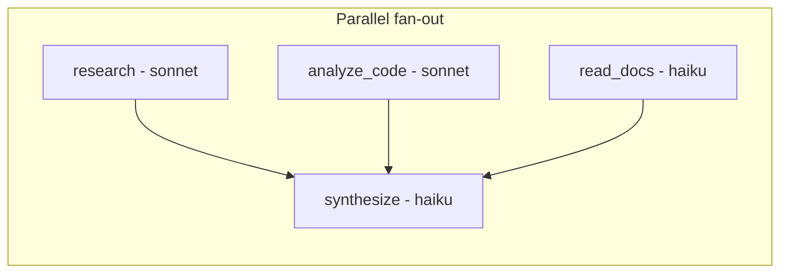
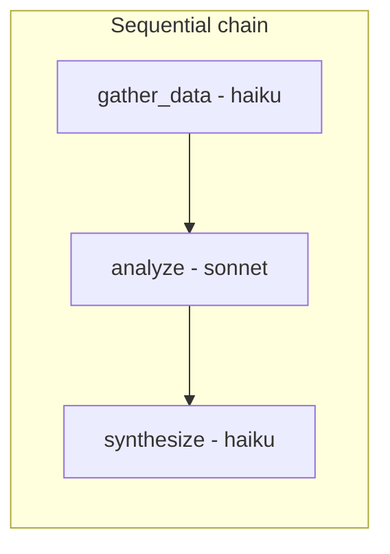
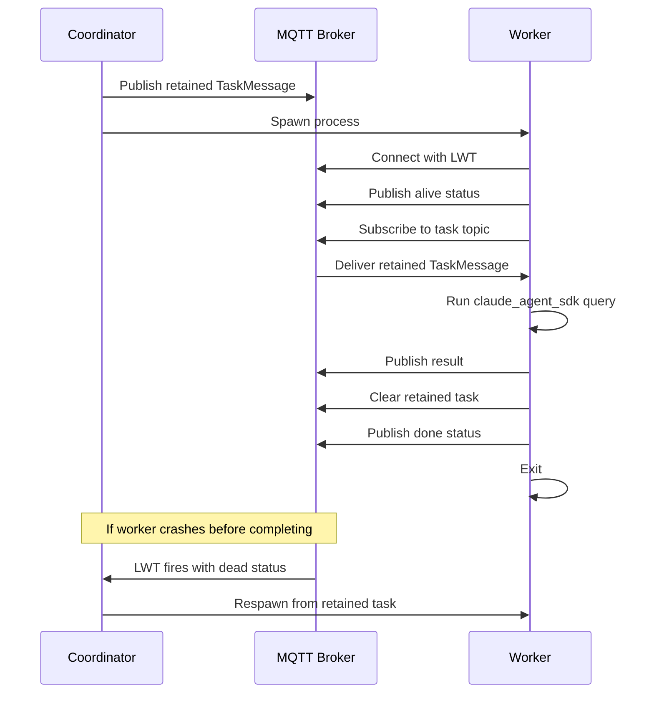
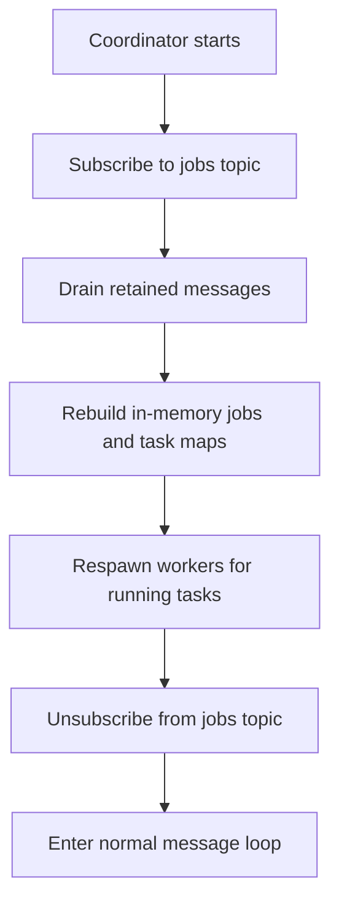

# Skitter Architecture

## Design Principles

1. **Zero-LLM coordinator.** The coordinator makes no AI calls. Planning and synthesis are worker tasks in the DAG. `claude_agent_sdk` is only imported by the worker process.

2. **Stateless coordinator.** All state is derived from retained MQTT messages. If the coordinator crashes, it recovers jobs from the broker on restart and respawns interrupted workers.

3. **MQTT as the backbone.** The broker is the single source of truth. Retained messages act as durable storage for job specs and task assignments. LWT (Last Will and Testament) handles worker crash detection.

## Request Lifecycle



**States explained:**

- **PlannerSpawned** — User publishes to inbound topic, coordinator spawns planner worker
- **DirectResponse** — Planner returns a direct answer, coordinator forwards to outbound
- **DAGBuilt** — Planner returns a task graph, coordinator builds DAG with synthesize node
- **WorkersRunning** — Workers execute in parallel; as results arrive, newly unblocked tasks spawn
- **Synthesizing** — All workers done, synthesize task combines results into final response

## Coordinator Message Loop

The coordinator subscribes to three topic patterns and reacts to each.



## DAG Execution

A delegated request produces a task graph. Tasks with no dependencies run in parallel. The synthesize node is auto-added as a leaf that depends on all other tasks.



Tasks can also form chains when the planner specifies dependencies.



The coordinator advances the graph with pure logic — no LLM calls:

1. Mark completed task as "done", store its result
2. Find tasks where all dependencies are "done" and status is "pending"
3. For each: build context from upstream results, publish retained task, spawn worker
4. Re-publish updated job spec

## Worker Lifecycle



## Recovery

On startup, the coordinator recovers from retained MQTT messages.



If a worker completed while the coordinator was down and cleared its retained task, the respawned worker finds no task and exits harmlessly.

## Model Selection

The planner picks a model for each delegated task from a configurable list.

### Configuration

```bash
# Available models (pipe-separated name=description pairs)
SKITTER_MODELS="haiku=Fast and cheap|sonnet=Balanced|opus=Most capable"

# Model for the planner itself
SKITTER_PLANNER_MODEL=sonnet
```

The model list and descriptions are injected into the planner's system prompt. The planner includes a `"model"` field per task. The coordinator validates the choice against the known list (falls back to the first model if unknown) and passes it through to the worker.

### Typical Assignments

| Task Type | Typical Model | Why |
|-----------|--------------|-----|
| Planner | sonnet | Routing decisions shape everything downstream |
| Simple file read / summarize | haiku | Fast, cheap, sufficient for extraction |
| Code analysis / complex reasoning | sonnet or opus | Needs stronger capabilities |
| Synthesize | haiku | Combining text, no deep reasoning needed |

## Topic Scheme

```
skitter/
├── inbound/{chat_id}                          # User → coordinator
├── outbound/{chat_id}                         # Coordinator → user
├── jobs/{chat_id}                             # Retained job spec (DAG + results)
├── tasks/{agent}/{chat_id}/{task_id}          # Retained task for worker
├── results/{chat_id}/{task_id}                # Worker result → coordinator
└── workers/{chat_id}/{task_id}/status         # Worker liveness (LWT)
```

The coordinator subscribes at startup to: `skitter/inbound/+`, `skitter/results/+/+`, `skitter/workers/+/+/status`.
